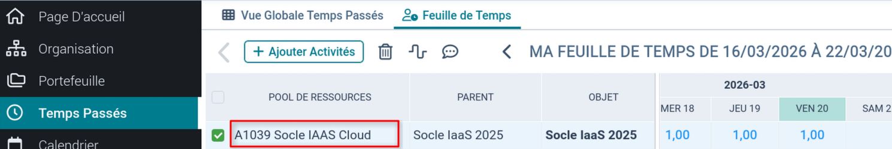

# PDF Export Generator

Générateur de rapports de temps au format PDF, **100 % côté navigateur**, sans serveur.
Hébergé sur GitHub Pages : [https://arioual-utech.github.io/pdf_generator/](https://ludovictual-system-u.github.io/pdf_generator/)

---

## Fonctionnalités

- Calendrier interactif calé sur le mois en cours, navigable mois par mois
- Champ **Pool de ressources** paramétrable
- Sélecteurs rapides : tous les jours de semaine, tous les lundis/vendredis, tous les weekends
- Sélection par plage de jours
- Génération et téléchargement du PDF en un clic, directement dans le navigateur
- Aucune donnée envoyée sur un serveur — tout est local

---

## Utilisation

Ouvrir l'application dans le navigateur (GitHub Pages ou fichier local), puis :

1. Renseigner le champ **Pool de ressources** (voir section dédiée ci-dessous)
2. Cliquer sur les jours d'absence dans le calendrier (ou utiliser les sélecteurs rapides)
3. Cliquer sur **Générer le PDF** — le fichier `Triskool_MM-YYYY.pdf` est téléchargé automatiquement

---

## Gestion des demi-journées

Chaque clic sur un jour ouvré fait cycler son état :

| Clics | Couleur | Effet dans le PDF |
|---|---|---|
| 1er clic | Bleu — absence journée entière | PdR = 0 / EXT = 1 |
| 2ème clic | Orange — demi-journée d'absence | PdR = 0,5 / EXT = 0,5 |
| 3ème clic | Blanc — retour jour travaillé | PdR = 1 / EXT = 0 |


Les sélecteurs rapides et la sélection par plage posent toujours des absences **journée entière**.

---

## Trouver la valeur « Pool de ressources »

Le champ **Pool de ressources** correspond à l'identifiant de votre activité.
Pour le retrouver, connectez-vous à votre outil de saisis de temps et repérez la valeur dans la colonne **Pool de ressources** de votre feuille de temps mensuelle.



> La valeur par défaut dans l'application est `A1039 Socle IAAS Cloud` — modifiez-la si votre pool est différent.

---

## Format du PDF généré

Le PDF suit le format standard :

- **Tableau récapitulatif** : totaux PdR (jours travaillés) et EXT (jours d'absence)
- **Matrice des jours** : grille mensuelle avec une ligne par type (travail / absence)
  - Week-ends : 0 partout
  - Jours d'absence sélectionnés : PdR = 0, EXT = 1
  - Jours travaillés : PdR = 1, EXT = 0

---

## Structure du projet

```
index.html              Application complète (HTML + CSS + JS, sans dépendances installées)
pool_de_ressources.png  Capture d'écran — où trouver le pool de ressources
full_half_day.png       Capture d'écran — illustration journée entière vs demi-journée
.gitignore              Exclut les PDF générés localement
```

### Dépendances embarquées (CDN, aucune installation)

| Bibliothèque | Rôle |
|---|---|
| [Font Awesome 6](https://cdnjs.cloudflare.com/ajax/libs/font-awesome/6.0.0/css/all.min.css) | Icônes |
| [jsPDF 2.5.1](https://cdnjs.cloudflare.com/ajax/libs/jspdf/2.5.1/jspdf.umd.min.js) | Génération PDF côté client |
